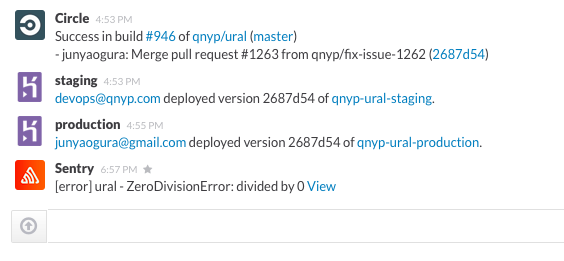

# sentry-to-slack

**FYI: NOW SLACK HAS OFFICIAL SENTRY INTEGRATION. USE [ https://my.slack.com/services/new/sentry](https://my.slack.com/services/new/sentry)**

This is a rack application receives a webhooks request from [Sentry](https://getsentry.com/) and notify it to [Slack](https://slack.com/).

## Prerequisite to deployment

* Heroku account and Heroku Toolbelt
* Sentry account and [Sentry Webhooks](https://github.com/getsentry/sentry-webhooks)
* Slack account

## Usage

Create an app.

    $ heroku apps:create YOUR_APP_NAME
    Creating YOUR_APP_NAME... done, stack is cedar
    http://YOUR_APP_NAME.herokuapp.com/ | git@heroku.com:YOUR_APP_NAME.git

Set config vars.

    $ heroku config:set \
      SLACK_TOKEN="YOUR_SLACK_INCOMING_WEBHOOKS_TOKEN" \
      SLACK_TEAM="YOUR_SLACK_TEAM_ID" \
      SLACK_CHANNEL="#CHANNEL_NAME"

Push to deploy.

    $ git push heroku master

Set http://YOUR_APP_NAME.herokuapp.com/notify as a Sentry webhooks endpoint.

## Contributing

1. Fork it
2. Create your feature branch (`git checkout -b my-new-feature`)
3. Commit your changes (`git commit -am 'Added some feature'`)
4. Push to the branch (`git push origin my-new-feature`)
5. Create new Pull Request

## LICENSE

MIT License.
